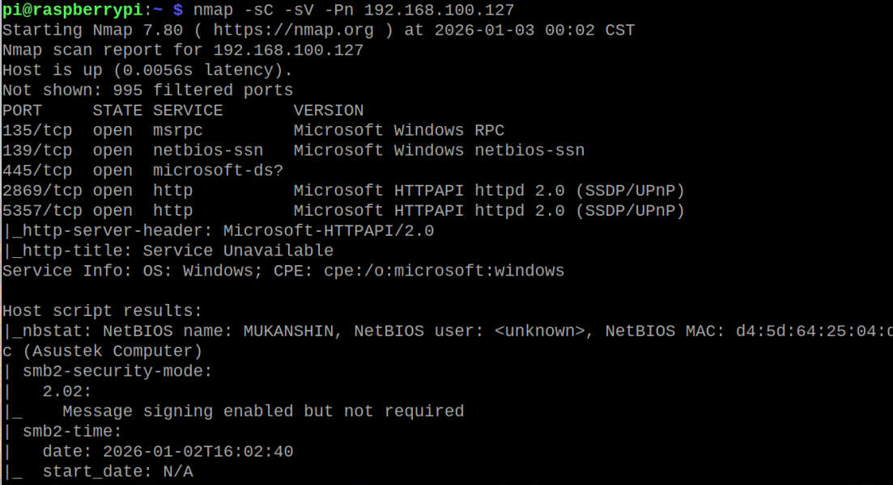

🧾 SMB Enumeration 
🎯 Objective

The goal of this lab is to practice SMB (Server Message Block) enumeration on a Windows target to identify shared resources, possible misconfigurations, and information leakage.

🖥️ Target Information

Target Type: Windows Machine

Ports Identified:

135/tcp – MSRPC

139/tcp – NetBIOS-SSN

445/tcp – Microsoft-DS / SMB

These ports indicate that Windows file sharing services are enabled, making SMB enumeration an important next step.

🔎 Tools Used

nmap

smbclient

enum4linux

(optional) smbmap

🧪 Enumeration Steps
1️⃣ Initial SMB Service Discovery

I first confirmed the SMB services using Nmap:

nmap -sC -sV 192.168.100.127

This helped identify running SMB services and versions.
📸 

2️⃣ Listing Available SMB Shares

I attempted to list available SMB shares to see if anonymous access was allowed:

smbclient -L 192.168.100.127 -N

This checks if the system allows guest access without credentials.
📸 

If any readable shares appeared, I attempted to access them:

smbclient //TARGET_IP/SHARENAME -N

✅ Findings

SMB Enumeration Findings

Identified SMB ports open on the target: 135, 139, 445

Connected to the SMB service using smbclient

Gained access to an SMB share without authentication (anonymous access)

Listed the files inside the share and found a hello.txt file

Downloaded the file locally using get hello.txt

Viewed the contents of the file on my machine using cat

This confirms SMB misconfiguration because files can be accessed and downloaded without credentials, which could expose sensitive information

📚 What I Learned

During this SMB enumeration exercise, I learned how to identify and interact with Windows file sharing services. By discovering open SMB ports (135, 139, 445), 
I understood the role of these services in a network environment. Using smbclient, I connected to the SMB share and explored available files. 
I was able to download a text file (hello.txt) and view its contents on my local machine. 
This exercise taught me how misconfigured SMB permissions or anonymous access can allow unauthorized file retrieval. 
Overall, it reinforced the importance of proper enumeration, documenting findings, and understanding the potential risks of exposed SMB shares in real-world scenarios.

🔐 Ethical Note
All testing in this write‑up was performed legally in my own controlled lab environment for learning purposes only. No unauthorized systems were accessed.
This test was performed in a controlled lab environment. Enumeration was only done on systems I have permission to test.
